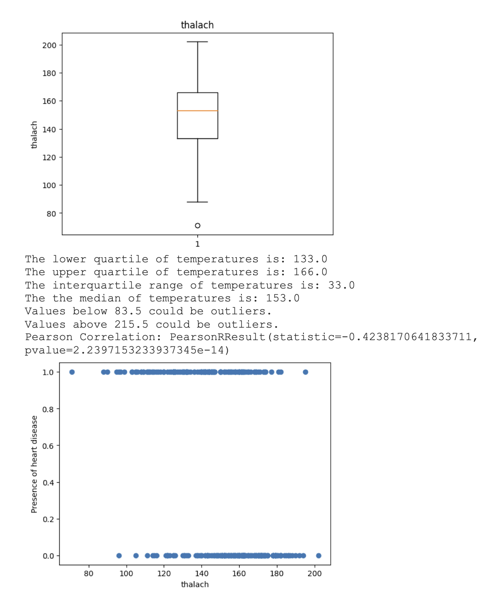
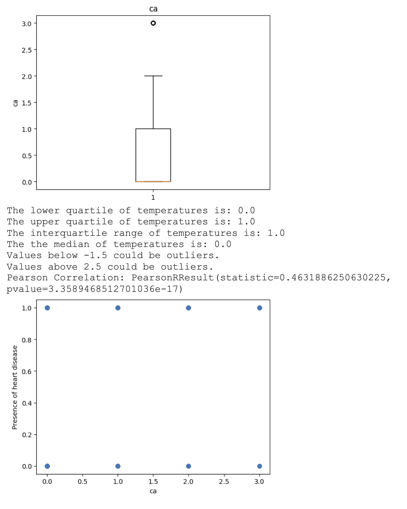

# Project-4  
  
## Quick Links  
[Project Plan](Documents/UofT-Project04-Plan.pdf)  
[Napkin Drawings](Documents/Napkin-Drawing-Project04.pdf)  
[Presentation](Presentation/Project-4-Group-1.pptx)  
  
Google Colab:  
[ETL](https://colab.research.google.com/drive/1GpQ29JKaLhXdqncHfyx6sBMs4xKNJHgV?usp=sharing)  
[EDA Work](https://colab.research.google.com/drive/1XUSxIBGcxdADNkhOIuPoS6MyIlEaA7nr?usp=sharing)  
[ML Work](https://colab.research.google.com/drive/114IJn53fqlRZWbhUOkqoIbAn23Wv0SmR?usp=sharing)  
  
Tableau:  
[Tableau Public](https://public.tableau.com/views/Project4-HeartDisease/Story1?:language=en-US&publish=yes&:display_count=n&:origin=viz_share_link)  
  
Github Pages:  
[Heart disease prediction app](https://johnjamescad.github.io/Project-4/)  
  
## Table of Contents  
* [Data Source](#user-content-data-source)  
* Data Preprocessing  
  * [Extract Transform Load or ETL](#user-content-extract-transform-load-etl)  
  * [Exploratory Data Analysis or EDA](#user-content-exploratory-data-analysis-eda)  
* [Machine Learning](#user-content-machine-learning)  
* [System Design](#user-content-system-design)  
  
### Data Source
The dataset used for this project is the Cleveland Heart Disease dataset taken from the UCI repository, which covers 13 features and the diagnosis as listed below:  
  
* Age - Sex
  * 1 = male
  * 0 = female
* Chest-pain type
  * 1 = typical angina
  * 2 = atypical angina
  * 3 = non — anginal pain
  * 4 = asymptotic
* Resting Blood Pressure (in mmHg) - Serum Cholesterol (in mg/dl)
* Fasting Blood Sugar (in mg/dl)
* Resting ECG
  * 0 = normal
  * 1 = having ST-T wave abnormality
  * 2 = left ventricular hypertrophy
* Max heart rate achieved - Exercise induced angina
  * 1 = yes
  * 0 = no
* ST depression induced by exercise relative to rest
* Peak exercise ST segment
  * 1 = upsloping
  * 2 = flat
  * 3 = downsloping
* Number of major vessels (0–3) colored by fluoroscopy
* Thalassemia (Thal)
  * 3 = normal
  * 6 = fixed defect
  * 7 = reversible defect
* Diagnosis (Whether the individual is suffering from heart disease or not)
  * 0 = absence
  * 1, 2, 3, 4 = present

### Extract Transform Load \(ETL\)  
Using Pandas we loaded the CSV file as a DataFrame. We had to apply a transformation for the diagnosis column to convert values 1, 2, 3 and, 4 to 1. Then we loaded the data to a PostgreSQL table (in AWS RDS).  
  
### Exploratory Data Analysis \(EDA\)  
We connected to the table we created in AWS RDS. We started with Pandas describe\( \) method for EDA.  
  
  
After which we created Pearson Correlation Coefficient matrix and plotted it, which should reasonable correlation between the feature variables and the target.  
  
  
We continued our analysis by looking for outliers, plotting with box plots and scatter plots for all 13 features against the target.
  
  
  
  
  
  
  
  
  
  
  
  
  
  
### Machine Learning  
We applied various supervised machine learning models and neural networks. Before fitting the models, we did scaling with Standard Scaler and also divided the dataset to training and testing data.  
  
Following are the supervised ML models we used:  
* Logistic regression  
* Support Vector Machine / Classifier or SVM / SVC  
* Random Forest  
* Decision Tree  
* K Nearest Neighbor or KNN  
  
To measure the performance of the Machine Learning model, we use precision, recall and accuracy (f-score).  
  
The aforementioned models gave following metrics:  

Logistic regression  
  
Support Vector Machine / Classifier or SVM / SVC  
  
Random Forest  
  
Decision Tree  
  
K Nearest Neighbor or KNN  
  
  
With Keras tuner we found a neural network model that gave us better accuracy.  
  
Top 3 Metrics  
  
Top 3 Parameters  
  
Best Model - Metrics  
  
Best Model - Parameters  
  

The precision of a model describes how many detected items are truly relevant. It is calculated by dividing the true positives by overall positives.  
  
Recall is a measure of how many relevant elements were detected. Therefore it divides true positives by the number of relevant elements.  
  
The F-score is a measure of a test's accuracy. It is calculated from recall and precision values.  
  
### System Design  
  