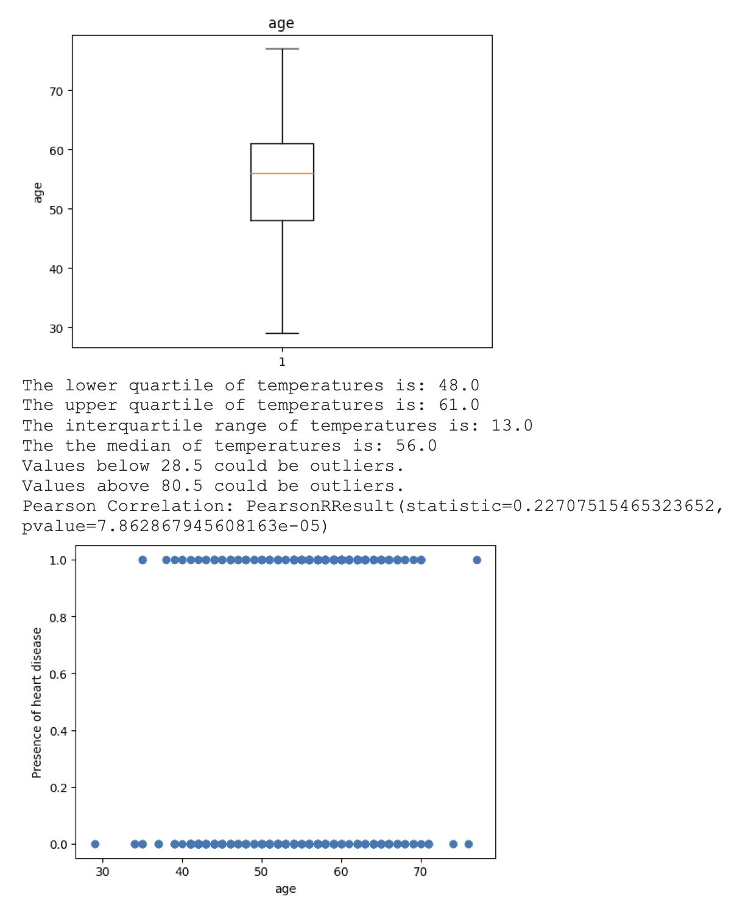
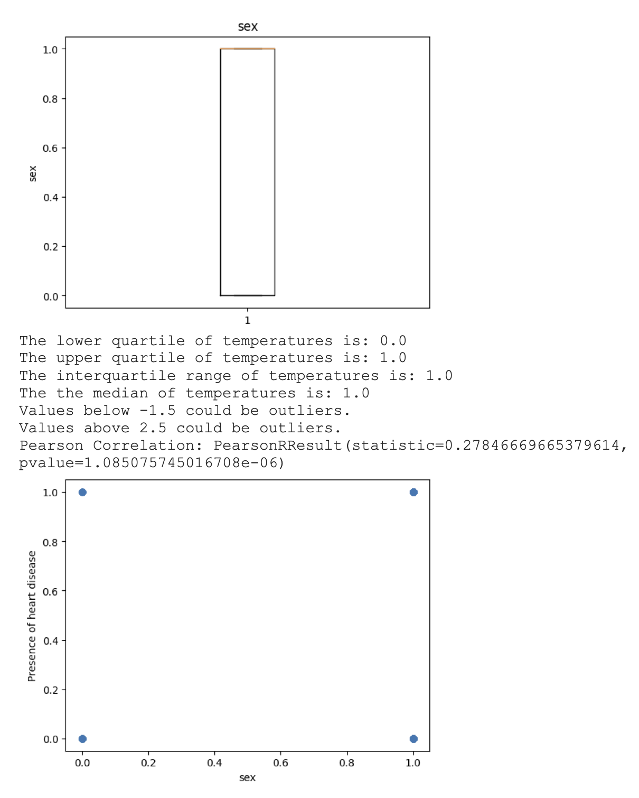
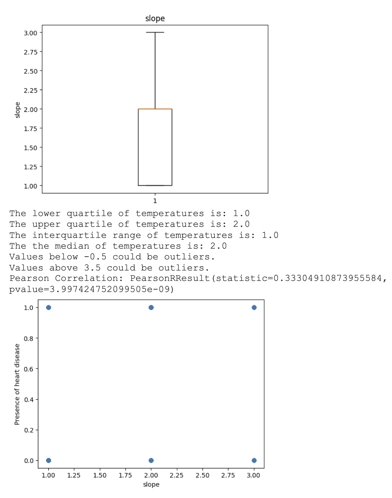

# Project-4  
  
## Quick Links  
[Project Plan](Documents/UofT-Project04-Plan.pdf)  
  
Google Colab:  
[ETL](https://colab.research.google.com/drive/1GpQ29JKaLhXdqncHfyx6sBMs4xKNJHgV?usp=sharing)  
[EDA Work](https://colab.research.google.com/drive/1XUSxIBGcxdADNkhOIuPoS6MyIlEaA7nr?usp=sharing)  
[ML Work](https://colab.research.google.com/drive/114IJn53fqlRZWbhUOkqoIbAn23Wv0SmR?usp=sharing)  
  
Tableau:  
[Tableau Public](https://public.tableau.com/views/Project4-HeartDisease/Story1?:language=en-US&publish=yes&:display_count=n&:origin=viz_share_link)  
  
Github Pages:  
[Heart disease prediction app](https://johnjamescad.github.io/Project-4/)  
  
## Table of Contents  
* Data Preprocessing  
  * [Exploratory Data Analysis or EDA](#user-content-exploratory-data-analysis-eda)  
* [Machine Learning](#user-content-machine-learning)  
  
### Exploratory Data Analysis \(EDA\)  
We started with Pandas describe\( \) method.  
  
  
After which we created Pearson Correlation Coefficient matrix and plotted it, which should reasonable correlation between the feature variables and the target.  
  
  
We continued our analysis by looking for outliers, plotting with box plots and scatter plots for all 13 features against the target.
  
  
  
  
  
  
  
  
  
  
  
  
  

### Machine Learning  
To measure the performance of the Machine Learning model, we use precision, recall and accuracy (f-score).  
  
The precision of a model describes how many detected items are truly relevant. It is calculated by dividing the true positives by overall positives.  
  
Recall is a measure of how many relevant elements were detected. Therefore it divides true positives by the number of relevant elements.  
  
The F-score is a measure of a test's accuracy. It is calculated from recall and precision values.  
  